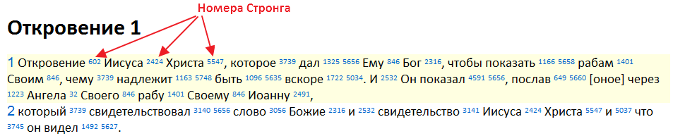

# Симфония Стронга

Оригиналы книг Библии написаны на древних еврейском и греческом языках, и русская Библия является уже переводом. Так как перевод не всегда точно или даже ошибочно передает смысл оригинала, предпочтением всегда остается чтение оригинала. Как узнать значение слова-оригинала? Посмотреть его значение в словаре. Однако, те, кто изучал любой иностранный язык, знают, что иногда этого недостаточно.

Есть забавная игра – Шнюкалка. Один загадывает слово-глагол – остальные пытаются его отгадать, задавая вопросы и заменяя в них угадываемое слово на глагол "шнюкать".

&mdash; Ты шнюкаешь каждый день?
&mdash; Да.
&mdash; Ты шнюкаешь три раза в день?
&mdash; Обычно да, но бывают исключения.
&mdash; Ты загадал слово "кушать"?
&mdash; Да, угадали!

В данном примере игры к слову "шнюкать" мы смогли подобрать русский аналог "кушать".

Чтобы более точно понять смысл слова-оригинала из Писаний, нужно поступить примерно также: собрать все стихи, где встречается данное слово, и попробовать подобрать аналог из родного языка. Поиск стихов следует осуществлять по книгам на языке-оригинале так как слово одного языка может быть передано несколькими словами другого. Например, за словом "светильник" скрываются греческие "λυχνία" (люхниа) – "подсвечник" и "πῦρ" (пюр) – "пламя".

Именно для упрощения поиска была создана Симфония Стронга. Симфония Стронга – это список всех слов, которые встречаются в оригинале Писаний, где каждому слову присвоен свой уникальный номер. Далее в переводе Писаний рядом с каждым переведенным словом указывается номер, соответствующий слову-оригиналу. Например, первые строки книги "Откровение" с Симфонией Стронга выглядят вот так:

**Рис. 1. Синодальный перевод с проставленными номерами Стронга.**

Строго говоря, Симфония – это не один список, а целых два: один составлен по еврейскому, а другой – по греческому тексту. Одному и тому же номеру в разных списках будут соответствовать разные слова. Например, под номером 430 в греческом тексте указано слово, переводимое как "терпеть", а в еврейском – "Бог". **Из этого вытекает важное правило: если номер Стронга взят из еврейского текста, то следует искать стихи с этим номером только в еврейском тексте; если из греческого – в греческом.** Первоисточник Ветхого Завета написан на еврейском; первоисточник Нового – на греческом. Поэтому для простоты можно перефразировать данное правило так: **если номер Стронга взят из Ветхого Завета, то ищем стихи в Ветхом Завете; если из Нового Завета – ищем в Новом Завете**.

Часто перед номером из греческого списка указывают букву "G" (Greece) или вообще ничего не указывают, а из арамейского – "H" (Hebrew) или "0" (ноль). То есть, G430 или 430 – "терпеть", а H430 или 0430 – "Бог".

Слова в обоих списках Симфонии расположены в алфавитном порядке, а номер слова – это простой его порядковый номер. Если взять два слова с соседними номерами, то они будут очень похожими друг на друга по написанию:

G101 – ἀ δ υ ν α τ έ ω
G102 – ἀ δ ύ ν α τ ο ς

Нередко бывает так, что **соседние слова близки не только по написанию, но и по значению**:

G3084 – λ υ τ ρ ό ω
G3085 – λ ύ τ ρ ω σ ι ς

Под G3084 указано слово, имеющее перевод "освобождать", а под G3085 – "освобождение". "Давать освобождение" и "освобождать" несут одинаковый смысл. Из этого вытекает еще одно правило: следует проверять соседние номера Стронга.

Как ранее было сказано, чтобы понять смысл слова-оригинала, нужно собрать все стихи, где встречается данное слово, и попробовать подобрать аналог из родного языка. Но бывают ситуации, когда такого аналога просто не существует. В этом случае следует подбирать образ, передающий смысл слова-оригинала. Например, еврейское слово "תִשָּׂא" (навсав) не имеет аналога русского. Чтобы понять его, нужно представить себе образ: человек несет предмет. Если предмет несется, то он расположен над человеком. Если он над человеком, то человек его поднял. Представили? Теперь наш образ в состоянии передать одновременно сразу два глагола: "носить" и "поднимать". И действительно, просмотрев все стихи с данным словом, мы увидим, что в одном случае оно переведено как "носить", в другом – "поднимать", в третьем – "уважить", "возвысить", а в четвертом – "*произ*-носить" (перенести мысль голосом). Пророческие книги, в т. ч. и Откровение, и места, описывающие храмовое служение – это книги образов. За словом стоит образ с целым набором свойств. Поэтому иногда стоит **представлять слова в виде образов**.
